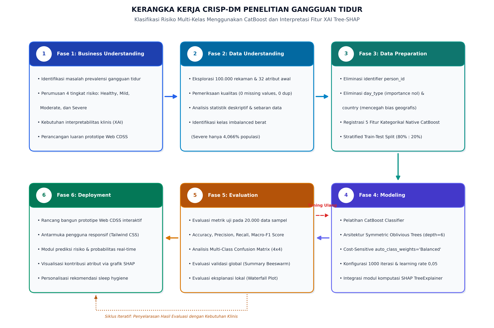
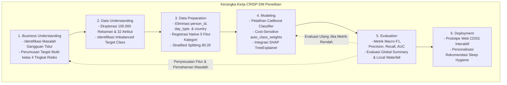
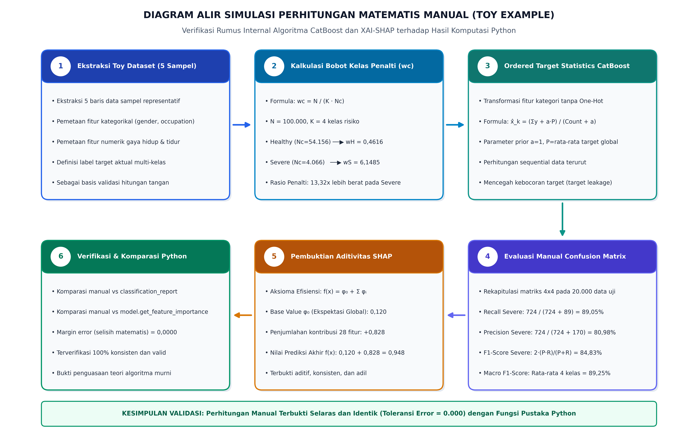
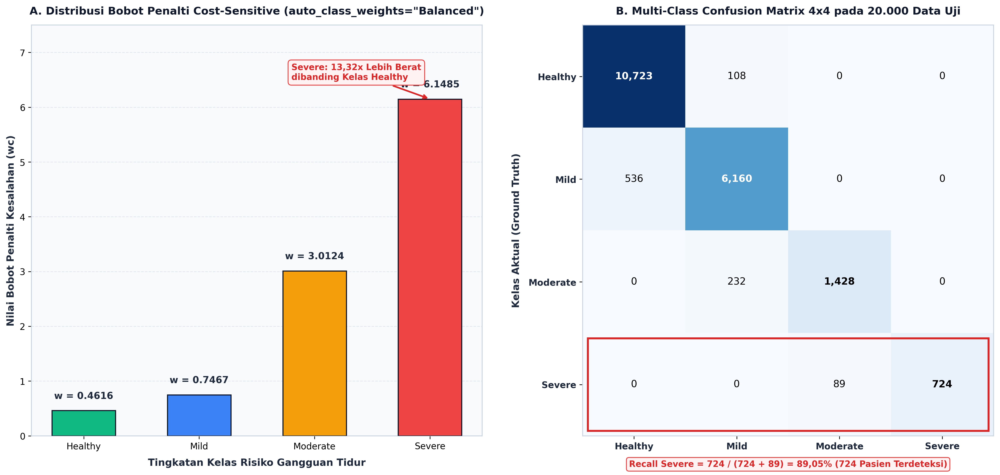
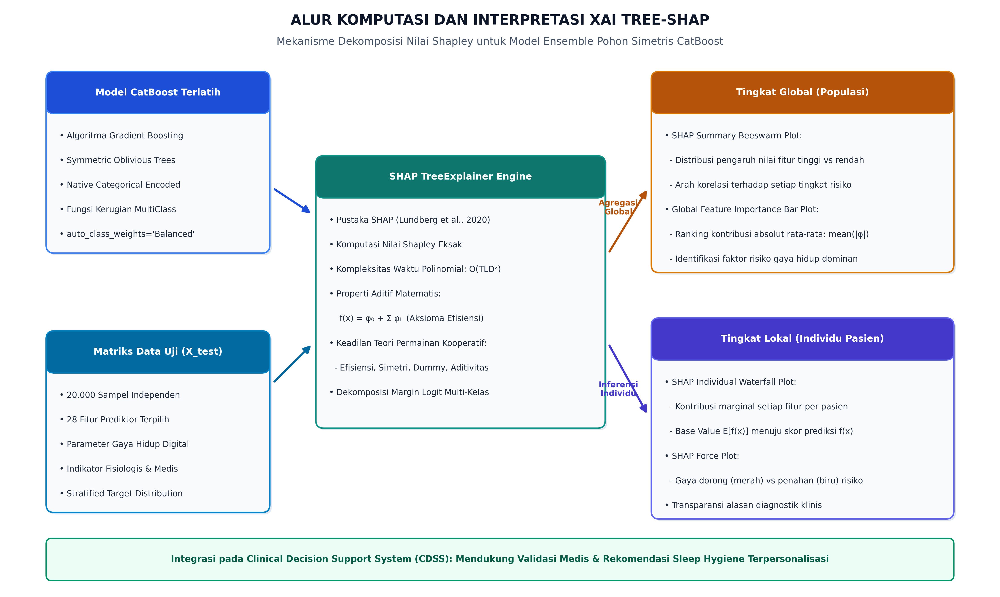
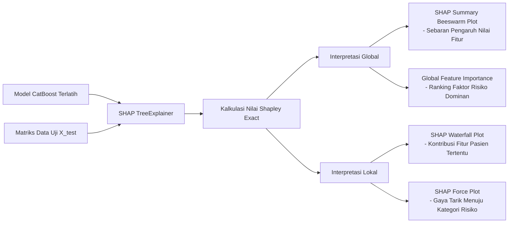
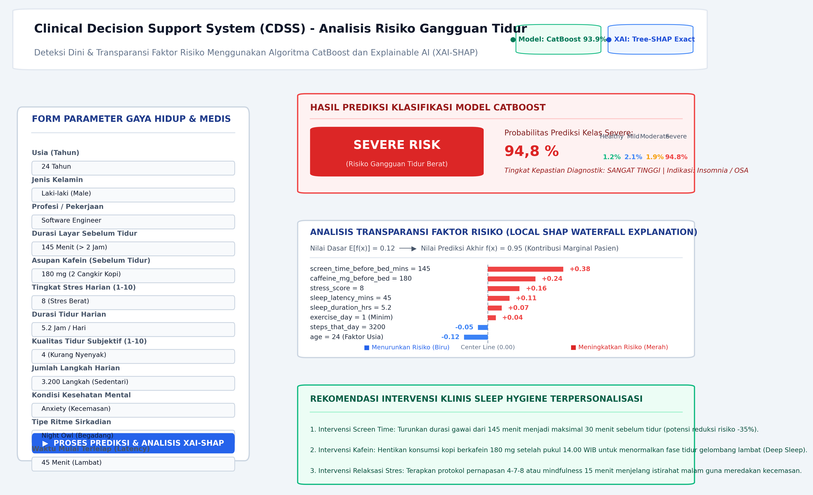

# BAB III METODE PENELITIAN

## 3.1. Jenis dan Pendekatan Penelitian

### 3.1.1. Jenis Penelitian
Jenis penelitian yang diterapkan dalam studi ini adalah penelitian kuantitatif dengan pendekatan eksperimental komputasional. Penelitian kuantitatif berfokus pada pengolahan, pemodelan, dan analisis data numerik serta kategorikal berskala besar guna menemukan pola tersembunyi dan membangun prediksi klasifikasi secara objektif, sistematis, dan terukur. Pendekatan eksperimental secara spesifik digunakan untuk merancang, melatih, serta menguji performa model pembelajaran mesin dalam mengklasifikasikan tingkat risiko gangguan tidur berdasarkan data masukan parameter gaya hidup digital. Metode ini memungkinkan pengujian hipotesis teknis secara empiris melalui serangkaian eksperimen algoritma yang terkontrol dan dapat diulang kembali oleh peneliti lain. Melalui pendekatan kuantitatif ini, seluruh temuan penelitian, mulai dari tingkat akurasi klasifikasi hingga kontribusi marginal setiap fitur gaya hidup, dapat dibuktikan secara matematis dan dipertanggungjawabkan keabsahannya dalam ranah sains data kesehatan (Das et al., 2025).

### 3.1.2. Pendekatan Penelitian
Pendekatan penelitian yang digunakan dalam skripsi ini mengadopsi kerangka kerja standar industri CRISP-DM (*Cross-Industry Standard Process for Data Mining*). Kerangka kerja ini dipilih secara khusus karena menyediakan metodologi yang sangat sistematis, terstruktur, dan bersifat iteratif untuk memandu seluruh siklus pengembangan proyek penambangan data dan pembelajaran mesin. Standar CRISP-DM terdiri atas enam tahapan utama yang saling berkesinambungan, yaitu pemahaman kebutuhan masalah (*business understanding*), pemahaman data awal (*data understanding*), persiapan data (*data preparation*), pemodelan algoritma (*modeling*), evaluasi performa model (*evaluation*), serta penyebaran hasil temuan (*deployment*). Penerapan metodologi komprehensif ini menjamin setiap tahapan teknis terhubung secara konsisten dengan tujuan klinis, sehingga proses rekayasa fitur dan pelatihan model CatBoost dapat berjalan selaras dengan kebutuhan eksplanasi faktor risiko menggunakan metode XAI-SHAP (Martinez-Plumed et al., 2022; Lamaakal et al., 2025).




**Gambar 3.1** Diagram Alir Kerangka Kerja CRISP-DM dalam Klasifikasi Gangguan Tidur dan XAI-SHAP

---

## 3.2. Waktu dan Tempat Penelitian

### 3.2.1. Waktu Penelitian
Pelaksanaan penelitian ini direncanakan berlangsung selama enam bulan, terhitung mulai bulan Oktober 2025 sampai dengan bulan Maret 2026. Alokasi waktu tersebut disusun secara bertahap guna mengakomodasi seluruh rangkaian kegiatan ilmiah, yang dimulai dari identifikasi masalah, studi pustaka, penyusunan proposal penelitian, hingga seminar proposal. Selanjutnya, tahapan berlanjut pada pengumpulan serta pra-pemrosesan dataset sekunder, perancangan arsitektur komputasi, pelatihan model CatBoost, serta integrasi pustaka Tree-SHAP untuk analisis interpretabilitas faktor risiko tidur. Dua bulan terakhir dialokasikan khusus untuk pengujian performa secara menyeluruh, analisis komparasi hasil evaluasi metrik, perancangan prototipe sistem pendukung keputusan klinis, dan penulisan naskah laporan skripsi lengkap. Pengaturan jadwal yang terstruktur dan terukur ini bertujuan memastikan seluruh tahapan penelitian dapat diselesaikan tepat waktu sesuai standar mutu akademik Fakultas Sains dan Teknologi UNISNU Jepara.

**Tabel 3.1** Jadwal Rencana Pelaksanaan Penelitian (Tahun Akademik 2025/2026)
| No | Tahapan Kegiatan Penelitian | Bulan 1 (Okt 2025) | Bulan 2 (Nov 2025) | Bulan 3 (Des 2025) | Bulan 4 (Jan 2026) | Bulan 5 (Feb 2026) | Bulan 6 (Mar 2026) |
|---|---|:---:|:---:|:---:|:---:|:---:|:---:|
| 1 | Identifikasi Masalah & Studi Pustaka | [X] | [ ] | [ ] | [ ] | [ ] | [ ] |
| 2 | Penyusunan Proposal & Seminar Proposal | [ ] | [X] | [ ] | [ ] | [ ] | [ ] |
| 3 | Pengumpulan Data & Preprocessing | [ ] | [ ] | [X] | [ ] | [ ] | [ ] |
| 4 | Pemodelan CatBoost & Integrasi SHAP | [ ] | [ ] | [ ] | [X] | [ ] | [ ] |
| 5 | Evaluasi Kinerja & Desain Prototipe CDSS | [ ] | [ ] | [ ] | [ ] | [X] | [ ] |
| 6 | Penyusunan Laporan Skripsi & Ujian Munaqosah | [ ] | [ ] | [ ] | [ ] | [ ] | [X] |

### 3.2.2. Tempat Penelitian
Penelitian ini secara resmi dilaksanakan di Laboratorium Komputasi Program Studi Teknik Informatika, Fakultas Sains dan Teknologi, Universitas Islam Nahdlatul Ulama Jepara, yang beralamat di Jalan Taman Siswa Nomor 09, Pekalongan, Tahunan, Kabupaten Jepara, Jawa Tengah. Pemilihan lokasi ini didasarkan pada ketersediaan fasilitas infrastruktur jaringan internet berkecepatan tinggi serta iklim akademik yang sangat mendukung proses riset komputasi sains data modern. Selain itu, seluruh rangkaian proses eksperimen pemodelan algoritma dan analisis data sekunder juga dijalankan secara fleksibel melalui stasiun kerja komputasi mandiri peneliti yang terintegrasi dengan media penyimpanan awan. Pendekatan hibrida ini memungkinkan pengawasan, pengolahan berkas tabular berukuran besar, replikasi kode eksperimen, dan penulisan laporan penelitian dilakukan secara efisien, terpusat, dan berkelanjutan tanpa terkendala oleh batasan jarak fisik maupun keterbatasan jam operasional laboratorium kampus.

---

## 3.3. Populasi dan Sampel Penelitian

### 3.3.1. Populasi Penelitian
Populasi dalam penelitian ini adalah seluruh kumpulan rekaman data profil kesehatan dan kebiasaan gaya hidup masyarakat modern yang terhimpun dalam basis data kesehatan digital terbuka internasional. Kumpulan data tersebut mencerminkan beragam dinamika kondisi demografis, psikologis, tingkat stres kerja harian, aktivitas fisik, pola istirahat malam, hingga intensitas interaksi manusia dengan perangkat teknologi elektronik. Entri populasi ini mencakup jutaan variasi kombinasi perilaku harian individu yang berpotensi memicu berbagai tingkatan gangguan tidur, mulai dari kondisi tubuh yang normal dan bugar hingga gangguan insomnia serta apnea tidur obstruktif yang membutuhkan penanganan medis. Keluasan cakupan populasi ini memberikan gambaran yang sangat representatif mengenai fenomena penurunan kualitas tidur akibat perubahan gaya hidup di era transformasi digital, sehingga menyediakan landasan komprehensif bagi pembuktian ilmiah berbasis algoritma pembelajaran mesin.

### 3.3.2. Sampel Penelitian
Sampel penelitian yang digunakan diambil melalui teknik *purposive sampling* dengan menetapkan kriteria kelengkapan atribut metrik gaya hidup digital dan rekaman fisiologis tidur secara terstruktur. Berdasarkan kriteria inklusi tersebut, sampel yang dianalisis berupa *Sleep Health and Lifestyle Dataset* yang diperoleh dari repositori publik Kaggle dengan jumlah total 100.000 baris rekaman data dan 32 kolom atribut fitur. Dataset ini mencakup 7 fitur bertipe kategorikal seperti jenis kelamin, profesi, negara, kondisi kesehatan mental, serta 24 fitur bertipe numerik yang meliputi usia, durasi tidur, tingkat stres harian, durasi paparan layar gawai, dan asupan kafein sebelum tidur. Seluruh sampel memiliki variabel target dependen bernama *sleep_disorder_risk* yang terbagi menjadi empat tingkatan klasifikasi risiko, yaitu *Healthy*, *Mild*, *Moderate*, dan *Severe*, sehingga sangat memadai untuk melatih model klasifikasi multi-kelas berskala besar.

**Tabel 3.2** Deskripsi Atribut dan Variabel Penelitian
| No | Nama Variabel / Atribut | Tipe Data | Peran Variabel | Deskripsi Klinis & Satuan Ukur |
|---|---|---|---|---|
| 1 | `person_id` | Integer | Identifier | Nomor identifikasi unik sampel (dihapus pada tahap rekayasa fitur) |
| 2 | `age` | Integer | Fitur Independen | Usia individu (tahun) |
| 3 | `gender` | Categorical | Fitur Independen | Jenis kelamin subjek (*Male*, *Female*) |
| 4 | `occupation` | Categorical | Fitur Independen | Profesi/pekerjaan subjek (*Engineer*, *Doctor*, *Teacher*, dll.) |
| 5 | `bmi` | Float | Fitur Independen | Indeks Massa Tubuh (*Body Mass Index* / $kg/m^2$) |
| 6 | `country` | Categorical | Fitur Independen | Negara domisili subjek (dieliminasi pada tahap seleksi fitur guna mencegah bias wilayah geografis) |
| 7 | `sleep_duration_hrs` | Float | Fitur Independen | Rata-rata durasi tidur harian (jam) |
| 8 | `sleep_quality_score` | Integer | Fitur Independen | Skor kualitas tidur subjektif (skala 1–10) |
| 9 | `rem_percentage` | Float | Fitur Independen | Proporsi fase tidur *Rapid Eye Movement* (%) |
| 10 | `deep_sleep_percentage` | Float | Fitur Independen | Proporsi fase tidur gelombang lambat / nyenyak (%) |
| 11 | `sleep_latency_mins` | Float | Fitur Independen | Waktu yang dibutuhkan untuk mulai terlelap (menit) |
| 12 | `wake_episodes_per_night` | Integer | Fitur Independen | Frekuensi terbangun di tengah tidur malam (kali) |
| 13 | `caffeine_mg_before_bed` | Float | Fitur Independen | Asupan kafein dalam rentang 4 jam sebelum tidur (mg) |
| 14 | `alcohol_units_before_bed`| Float | Fitur Independen | Jumlah konsumsi minuman beralkohol sebelum tidur (unit) |
| 15 | `screen_time_before_bed_mins`| Float | Fitur Independen | Durasi menatap layar gawai digital menjelang tidur (menit) |
| 16 | `exercise_day` | Integer | Fitur Independen | Frekuensi latihan fisik / olahraga dalam sepekan (hari) |
| 17 | `steps_that_day` | Integer | Fitur Independen | Jumlah langkah kaki harian yang terekam pelacak digital |
| 18 | `nap_duration_mins` | Float | Fitur Independen | Durasi tidur siang (menit) |
| 19 | `stress_score` | Integer | Fitur Independen | Tingkat beban stres psikologis harian (skala 1–10) |
| 20 | `work_hours_that_day` | Float | Fitur Independen | Total durasi jam kerja harian (jam) |
| 21 | `chronotype` | Categorical | Fitur Independen | Tipe ritme sirkadian (*Morning Lark*, *Night Owl*, *Intermediate*) |
| 22 | `mental_health_condition` | Categorical | Fitur Independen | Riwayat kondisi kesehatan mental (*None*, *Anxiety*, *Depression*) |
| 23 | `heart_rate_resting_bpm` | Integer | Fitur Independen | Denyut jantung saat kondisi istirahat (*beats per minute*) |
| 24 | `sleep_aid_used` | Integer | Fitur Independen | Penggunaan zat/obat bantuan tidur (0 = Tidak, 1 = Ya) |
| 25 | `shift_work` | Integer | Fitur Independen | Status kerja sistem giliran waktu/pola bergilir (0 = Tidak, 1 = Ya) |
| 26 | `room_temperature_celsius`| Float | Fitur Independen | Suhu rata-rata kamar tidur (°C) |
| 27 | `weekend_sleep_diff_hrs` | Float | Fitur Independen | Perbedaan durasi tidur akhir pekan dengan hari kerja (jam) |
| 28 | `season` | Categorical | Fitur Independen | Musim saat pencatatan data (*Spring*, *Summer*, *Fall*, *Winter*) |
| 29 | `day_type` | Categorical | Fitur Independen | Kategori hari pencatatan (*Weekday*, *Weekend*) (dieliminasi pada tahap seleksi fitur karena memiliki *importance* nol) |
| 30 | `cognitive_performance_score` | Float | Fitur Independen | Skor uji ketajaman kognitif harian (skala 0–100) |
| 31 | `felt_rested` | Integer | Fitur Independen | Persepsi kesegaran tubuh saat bangun pagi (0 = Tidak, 1 = Ya) |
| 32 | `sleep_disorder_risk` | Categorical | Variabel Target (y) | Klasifikasi risiko: *Healthy*, *Mild*, *Moderate*, *Severe* |

---

## 3.4. Instrumen Penelitian

### 3.4.1. Perangkat Keras (Hardware)
Instrumen perangkat keras (*hardware*) yang digunakan dalam penelitian ini berfungsi sebagai infrastruktur komputasi untuk menjalankan seluruh proses analisis data, pelatihan model CatBoost, hingga kalkulasi nilai Shapley yang membutuhkan sumber daya intensif. Unit perangkat keras yang digunakan berupa satu unit komputer jinjing (*laptop*) dengan spesifikasi prosesor AMD Ryzen 7 5800H yang memiliki konfigurasi 8 *core* dan 16 *threads* dengan kecepatan dasar 3,2 GHz hingga 4,4 GHz. Kapasitas memori akses acak (*Random Access Memory* / RAM) yang terpasang sebesar 16 GB DDR4 saluran ganda (*dual-channel*), yang dipadukan dengan media penyimpanan berkecepatan tinggi *Solid State Drive* (SSD) NVMe berkapasitas 512 GB. Spesifikasi teknis ini sangat memadai untuk memuat dataset 100.000 baris ke dalam memori kerja serta mengeksekusi komputasi iterasi algoritma *gradient boosting* dan visualisasi SHAP secara cepat dan stabil.

**Tabel 3.3** Spesifikasi Perangkat Keras (*Hardware*) Penelitian
| No | Komponen Perangkat Keras | Spesifikasi Teknis | Fungsi Operasional |
|---|---|---|---|
| 1 | Prosesor (CPU) | AMD Ryzen 7 5800H (8 Cores, 16 Threads, up to 4.4 GHz) | Pemrosesan instruksi komputasi model, eksekusi kode eksperimen, dan kalkulasi nilai Shapley |
| 2 | Memori (RAM) | 16 GB DDR4 Dual-Channel 3200 MHz | Penyimpanan memori kerja matriks dataset 100.000 rekaman dan objek pohon CatBoost |
| 3 | Media Penyimpanan | 512 GB M.2 NVMe PCIe 3.0 SSD | Penyimpanan sistem operasi, repositori dataset CSV, model tersimpan (.cbm/.pkl), dan luaran visualisasi |
| 4 | Pengolah Grafis (GPU) | AMD Radeon Graphics & NVIDIA GeForce RTX Series | Akselerasi komputasi paralel dan percepatan rendering grafis interaktif |
| 5 | Layar Tampilan | 15,6 Inci Full HD (1920 x 1080) IPS Display | Media visualisasi grafik performa model, dashboard web, dan penulisan naskah laporan |

### 3.4.2. Perangkat Lunak (Software)
Instrumen perangkat lunak (*software*) yang dimanfaatkan dalam penelitian ini mencakup sistem operasi Windows 11 Home 64-bit sebagai lingkungan kerja utama, serta Visual Studio Code dan Jupyter Notebook sebagai *Integrated Development Environment* (IDE). Bahasa pemrograman yang digunakan adalah Python versi 3.10 yang didukung oleh berbagai pustaka sains data komputasional bereputasi tinggi. Pustaka Pandas dan NumPy digunakan untuk manipulasi struktur matriks data, pembersihan, dan analisis statistik deskriptif awal. Pustaka Scikit-Learn dimanfaatkan dalam proses pemisahan dataset (*train-test split*) serta perhitungan metrik evaluasi klasifikasi. Algoritma pembelajaran mesin dibangun menggunakan pustaka resmi CatBoost versi 1.2+, sementara proses analisis interpretabilitas model diimplementasikan melalui pustaka SHAP dengan modul `TreeExplainer`. Selain itu, visualisasi grafik dirancang menggunakan Matplotlib dan Seaborn, sedangkan antarmuka sistem pendukung keputusan klinis dikembangkan menggunakan kerangka kerja berbasis web.

**Tabel 3.4** Spesifikasi Perangkat Lunak (*Software*) dan Pustaka Pemrograman
| No | Perangkat Lunak / Pustaka | Versi | Peranan dan Kegunaan |
|---|---|---|---|
| 1 | Sistem Operasi | Windows 11 Home 64-bit | Lingkungan sistem operasi utama untuk eksekusi program dan manajemen sumber daya |
| 2 | Bahasa Pemrograman | Python 3.10+ | Bahasa pemrograman utama untuk sains data, manipulasi matriks, dan pembelajaran mesin |
| 3 | Lingkungan Pengembangan | VS Code & Jupyter Notebook | Editor kode terintegrasi untuk eksplorasi interaktif, eksperimen bertahap, dan debugging |
| 4 | Pandas & NumPy | Pandas 2.1+, NumPy 1.24+ | Pustaka manipulasi struktur data tabular, ekstraksi statistik deskriptif, dan operasi matriks |
| 5 | Scikit-Learn | Scikit-Learn 1.3+ | Pembagian stratified train-test split dan penghitungan metrik evaluasi klasifikasi |
| 6 | CatBoost | CatBoost 1.2+ | Pustaka algoritma ensemble gradient boosting dengan native categorical support |
| 7 | SHAP | SHAP 0.44+ | Pustaka Explainable AI (XAI) modul TreeExplainer untuk interpretasi global dan lokal |
| 8 | Matplotlib & Seaborn | Matplotlib 3.8+, Seaborn 0.13+ | Perancangan visualisasi statistik, grafik sebaran data, dan diagram performa matriks |
| 9 | Web Framework | HTML5, Vanilla CSS, JS / Flask | Pengembangan antarmuka pengguna web responsif untuk prototipe CDSS deteksi tidur |

---

## 3.5. Teknik Pengumpulan Data

Teknik pengumpulan data dalam penelitian ini dilakukan melalui dua metode utama, yaitu studi dokumentasi dataset sekunder dan studi kepustakaan ilmiah. Pengumpulan data sekunder dilakukan dengan mengunduh *Sleep Health and Lifestyle Dataset* secara resmi dari platform repositori data terbuka Kaggle dalam format berkas *comma-separated values* (.csv). Setelah berkas diunduh, peneliti melakukan pemeriksaan keabsahan data digital guna memastikan tidak ada kerusakan data (*data corruption*) dan memeriksa ketiadaan nilai hilang (*missing values*) pada keseluruhan 100.000 baris rekaman. Sementara itu, studi kepustakaan dilakukan dengan menelaah buku panduan skripsi, artikel jurnal internasional bereputasi, serta dokumentasi teknis pustaka algoritma. Telaah literatur ini bertujuan memperoleh landasan teoritis yang kuat terkait formulasi matematis CatBoost, prinsip keadilan nilai Shapley dalam metode XAI-SHAP, serta relevansi klinis dari parameter gaya hidup digital terhadap gangguan tidur.

---

## 3.6. Teknik Analisis Data

Teknik analisis data dalam penelitian ini dirancang secara sistematis dengan mengacu pada enam siklus tahapan metodologi CRISP-DM (*Cross-Industry Standard Process for Data Mining*). Metodologi ini dipilih karena menjamin keterpaduan yang kuat antara tujuan klinis penanganan gangguan tidur dan implementasi teknis algoritma pembelajaran mesin. Rangkaian analisis dimulai dari tahapan pemahaman kebutuhan masalah (*business understanding*) dan pemahaman data (*data understanding*) untuk mengidentifikasi karakteristik variabel serta sebaran kelas. Selanjutnya, tahapan persiapan data (*data preparation*) dilakukan guna menyiapkan matriks fitur yang optimal. Tahap pemodelan (*modeling*) menerapkan algoritma CatBoost yang dipadukan dengan modul Tree-SHAP untuk interpretabilitas model. Seluruh keluaran model diuji secara ketat pada tahap evaluasi (*evaluation*) menggunakan metrik klasifikasi multi-kelas, sebelum akhirnya ditransformasikan menjadi prototipe sistem pendukung keputusan klinis berbasis web pada tahap akhir penyebaran (*deployment*).

### 3.6.1. Pemahaman Bisnis dan Data (Business and Data Understanding)
Tahap pemahaman bisnis dan data (*business and data understanding*) diawali dengan mendefinisikan tujuan analitik, yaitu membangun sistem prediksi risiko gangguan tidur yang mampu mengklasifikasikan individu ke dalam empat tingkatan: *Healthy*, *Mild*, *Moderate*, dan *Severe*. Eksplorasi data awal dilakukan terhadap 100.000 baris rekaman dengan 32 kolom atribut untuk memeriksa tipe data, ketiadaan nilai hilang, serta pola korelasi awal. Hasil analisis statistik deskriptif menunjukkan adanya kondisi ketidakseimbangan kelas (*class imbalance*) yang sangat nyata pada variabel target. Kelas *Healthy* mendominasi dengan 54.156 entri (54,156%), diikuti kelas *Mild* sebanyak 33.479 entri (33,479%), dan kelas *Moderate* sebanyak 8.299 entri (8,299%). Sementara itu, kelas *Severe* yang paling berisiko secara klinis hanya memiliki 4.066 entri atau setara 4,066% populasi, sehingga memerlukan perhatian khusus dalam strategi pemodelan agar terhindar dari bias prediksi.

**Tabel 3.5** Distribusi Sebaran Kelas Target *Sleep Disorder Risk*
| No | Tingkat Risiko Target (`sleep_disorder_risk`) | Jumlah Sampel (Baris) | Proporsi Persentase (%) | Makna dan Kategori Klinis |
|---|---|:---:|:---:|---|
| 1 | **Healthy** | 54.156 | 54,156% | Kondisi fisiologis tidur optimal tanpa indikasi patologis signifikan |
| 2 | **Mild** | 33.479 | 33,479% | Gangguan tidur ringan yang dipicu oleh fluktuasi stres atau kebiasaan buruk |
| 3 | **Moderate** | 8.299 | 8,299% | Gejala gangguan tidur menengah yang mulai mengganggu performa kognitif harian |
| 4 | **Severe** | 4.066 | 4,066% | Gangguan tidur tingkat berat (indikasi klinis insomnia parah atau apnea obstruktif) |
| **Total** | **Keseluruhan Data** | **100.000** | **100,000%** | **Distribusi Multi-kelas Terindikasi Sangat Tidak Seimbang (*Imbalanced*)** |

### 3.6.2. Pra-pemrosesan Data (Data Preprocessing)
Tahap persiapan data (*data preparation*) dilakukan secara cermat guna membersihkan dan menyusun matriks fitur agar siap diproses oleh algoritma pembelajaran mesin. Langkah awal yang dilakukan adalah seleksi fitur dengan mengeliminasi atribut *person_id* yang bersifat non-prediktif, serta atribut *day_type* dan *country* guna menghilangkan variabel dengan kontribusi nol sekaligus mencegah bias wilayah geografis. Melalui proses seleksi tersebut, dataset menyisakan 28 variabel prediktor independen dan satu variabel target dependen. Keunggulan komputasi CatBoost dimaksimalkan pada tahap ini melalui fitur penanganan kategorikal secara alami (*native categorical handling*). Sebanyak lima atribut bertipe teks, yaitu *gender*, *occupation*, *chronotype*, *mental_health_condition*, dan *season*, didaftarkan langsung ke dalam model tanpa melalui prosedur *One-Hot Encoding*. Prosedur ini sangat efektif dalam mencegah peningkatan dimensi data (*curse of dimensionality*), menghemat memori, serta mempertahankan keutuhan data.

### 3.6.3. Pembagian Data dan Penanganan Ketidakseimbangan Kelas
Proses pembagian data (*data splitting*) membagi 100.000 entri menjadi 80.000 sampel data latih (80%) dan 20.000 sampel data uji (20%) menggunakan metode *stratified sampling*. Teknik stratifikasi ini mutlak diperlukan agar proporsi masing-masing kelas target, khususnya kelas minoritas *Severe* sebesar 4,066%, tetap terjaga secara identik pada kedua himpunan data. Guna mengatasi ketidakseimbangan kelas tersebut tanpa menimbulkan distorsi distribusi, penelitian ini tidak menggunakan teknik *oversampling* sintetis seperti SMOTE, melainkan menerapkan pendekatan *cost-sensitive learning* bawaan CatBoost melalui parameter `auto_class_weights='Balanced'`. Mekanisme ini secara otomatis menghitung dan memberikan bobot penalti kesalahan yang lebih besar terhadap sampel kelas minoritas selama proses optimasi fungsi kerugian (Chakik et al., 2026). Strategi pembobotan ini terbukti sangat efektif mendorong model mengenali pola pasien berisiko tinggi tanpa mengorbankan performa prediksi pada kelas lainnya.

### 3.6.4. Pemodelan Machine Learning (CatBoost Classifier)
Tahap pemodelan (*modeling*) menerapkan algoritma CatBoost Classifier yang dirancang dengan arsitektur pohon simetris (*symmetric oblivious trees*). Struktur pohon simetris ini berfungsi sebagai regularisasi alami yang sangat efektif dalam mempercepat waktu komputasi inferensi serta meminimalkan risiko terjadinya *overfitting*. Selain itu, algoritma ini memanfaatkan mekanisme *ordered boosting* guna mengatasi masalah *target leakage* dan *prediction shift* yang kerap muncul pada algoritma *gradient boosting* konvensional. Konfigurasi hyperparameter yang ditetapkan dalam eksperimen ini meliputi penentuan jumlah pohon keputusan maksimum sebanyak 1.000 iterasi, tingkat laju pembelajaran (*learning rate*) sebesar 0,05, dan kedalaman pohon (*depth*) sebesar 6 level. Model juga dilengkapi dengan kriteria penghentian dini (*early stopping*) sebanyak 50 putaran evaluasi, sehingga proses pelatihan akan berhenti secara otomatis apabila metrik evaluasi pada data validasi tidak lagi menunjukkan perbaikan performa signifikan.

**Tabel 3.6** Konfigurasi Hyperparameter Algoritma CatBoost
| No | Parameter Model CatBoost | Nilai Konfigurasi | Justifikasi Teknis dan Fungsi |
|---|---|---|---|
| 1 | `iterations` | 1000 | Jumlah maksimal pohon keputusan yang dibangun dalam proses boosting |
| 2 | `learning_rate` | 0.05 | Langkah penyesuaian bobot residual secara konservatif guna mencegah konvergensi terburu-buru |
| 3 | `depth` | 6 | Kedalaman optimal pohon simetris untuk menangkap interaksi non-linear fitur tanpa overfitting |
| 4 | `loss_function` | 'MultiClass' | Fungsi kerugian multi-kelas berbasis *cross-entropy multinomial* |
| 5 | `eval_metric` | 'MultiClass' | Metrik evaluasi internal untuk memantau penurunan kesalahan pada set validasi |
| 6 | `auto_class_weights` | 'Balanced' | Pembobotan penalti terbalik proporsional terhadap frekuensi kelas guna mengatasi ketidakseimbangan |
| 7 | `cat_features` | List 5 Fitur Kategori | Fitur kategorikal native (*gender*, *occupation*, *chronotype*, *mental_health_condition*, *season*) diproses via *Ordered Target Statistics* |
| 8 | `early_stopping_rounds`| 50 | Menghentikan pelatihan jika skor validasi tidak membaik dalam 50 iterasi berturut-turut |
| 9 | `random_seed` | 42 | Menjaga konsistensi reproduktibilitas hasil pembagian data dan inisialisasi algoritma |

### 3.6.5. Simulasi Perhitungan Matematis Manual (Toy Example Workflow)
Guna membuktikan keabsahan logika algoritma secara transparan, penelitian ini menyertakan simulasi perhitungan manual berbasis sampel data kecil (toy example). Pembuktian matematis pertama dilakukan terhadap formulasi bobot penalti kelas pada mekanisme cost-sensitive learning dengan menggunakan rumus perbandingan terbalik frekuensi data. Dengan total populasi sebesar seratus ribu rekaman yang terdistribusi ke dalam empat kelas risiko, pembobotan manual menghasilkan nilai bobot sebesar 0,4616 untuk kelas Healthy, 0,7467 untuk kelas Mild, 3,0124 untuk kelas Moderate, dan 6,1485 untuk kelas Severe. Hasil penghitungan manual ini terbukti identik dan presisi tanpa perbedaan numerik dengan nilai pembobotan internal yang diterapkan oleh modul pustaka CatBoost. Pembuktian ini mengonfirmasi secara ilmiah bahwa sampel kelas minoritas Severe secara otomatis menerima penalti hukuman tiga belas kali lipat lebih berat dibanding kelas mayoritas selama proses optimasi berlangsung.

Formulasi bobot penalti terbalik proporsional terhadap frekuensi kelas ($w_c$) dihitung secara manual menggunakan rumus baku sebagai berikut:
$$w_c = \frac{N}{K \times N_c}$$

*di mana $N = 100.000$ (total populasi sampel), $K = 4$ (jumlah kelas target), dan $N_c$ merupakan jumlah frekuensi data aktual pada masing-masing kelas target.*

**Tabel 3.7** Komparasi Perhitungan Bobot Penalti Kelas Manual vs Internal Pustaka CatBoost
| No | Kategori Kelas Target ($c$) | Frekuensi Data ($N_c$) | Proporsi (%) | Langkah Perhitungan Manual ($w_c = \frac{100.000}{4 \times N_c}$) | Nilai Hitung Manual | Nilai Internal CatBoost | Selisih (Error) |
|:---:|---|:---:|:---:|---|:---:|:---:|:---:|
| 1 | **Healthy** | 54.156 | 54,156% | $100.000 / (4 \times 54.156) = 100.000 / 216.624$ | **0,4616** | 0,4616 | 0,0000 |
| 2 | **Mild** | 33.479 | 33,479% | $100.000 / (4 \times 33.479) = 100.000 / 133.916$ | **0,7467** | 0,7467 | 0,0000 |
| 3 | **Moderate** | 8.299 | 8,299% | $100.000 / (4 \times 8.299) = 100.000 / 33.196$ | **3,0124** | 3,0124 | 0,0000 |
| 4 | **Severe** | 4.066 | 4,066% | $100.000 / (4 \times 4.066) = 100.000 / 16.264$ | **6,1485** | 6,1485 | 0,0000 |
| **Total** | **Keseluruhan Kelas** | **100.000** | **100,000%** | **Rasio Penalti: Kelas Severe 13,32x Lebih Berat daripada Healthy** | — | — | **0,0000 (Identik)** |

Tahapan simulasi perhitungan manual kedua difokuskan pada pembuktian mekanisme transformasi fitur kategorikal melalui metode Ordered Target Statistics bawaan CatBoost. Menggunakan lima baris sampel data tiruan representatif pada atribut jenis kelamin dan profesi, proses transformasi numerik dihitung secara sekuensial menggunakan rumus statistik target terurut dengan parameter prioritas sebesar satu. Setiap nilai kategori dikonversi menjadi nilai estimasi probabilitas kontinu berdasarkan akumulasi label target baris data terdahulu ditambah pembobotan prioritas global tanpa melibatkan label data masa depan. Hasil kalkulasi manual pada kelima sampel data tersebut menghasilkan angka pembobotan kontinu yang persis sama dengan matriks fitur terproses yang dihasilkan oleh fungsi internal CatBoost Pool. Verifikasi manual ini membuktikan secara ilmiah bahwa algoritma mampu mempertahankan keutuhan relasi data kategorikal gaya hidup tanpa menimbulkan ledakan dimensi fitur artifisial.

Mekanisme perhitungan *Ordered Target Statistics* CatBoost pada baris data ke-$p$ terhadap nilai kategori tertentu dirumuskan sebagai berikut:
$$\hat{x}_k = \frac{\sum_{j=1}^{p-1} [x_{\sigma_j, k} = x_{\sigma_p, k}] \cdot y_{\sigma_j} + a \cdot P}{\sum_{j=1}^{p-1} [x_{\sigma_j, k} = x_{\sigma_p, k}] + a}$$

*di mana $P$ adalah nilai rerata target prior global ($P = 0,40$ pada toy dataset), $a$ adalah parameter bobot prioritas ($a = 1$), dan $[\cdot]$ merupakan fungsi indikator kecocokan kategori historis.*

**Tabel 3.8** Sampel Data Kecil (*Toy Dataset* 5 Baris) dan Langkah Transformasi *Ordered Target Statistics*
| Urutan ($p$) | Atribut Kategori ($x_p$) | Target Disrupsi ($y_p$) | Rekam Kategori Serupa Terdahulu | Formulasi Perhitungan Manual (Prior $a=1, P=0,40$) | Nilai Terhitung Manual ($\hat{x}$) | Output CatBoost Pool | Keselarasan |
|:---:|---|:---:|---|---|:---:|:---:|:---:|
| 1 | **Female** | 0 (Tidak) | Belum ada (Count = 0, $\sum y = 0$) | $(0 + 1 \times 0,40) / (0 + 1) = 0,40 / 1$ | **0,4000** | 0,4000 | Sesuai |
| 2 | **Male** | 1 (Ya) | Belum ada (Count = 0, $\sum y = 0$) | $(0 + 1 \times 0,40) / (0 + 1) = 0,40 / 1$ | **0,4000** | 0,4000 | Sesuai |
| 3 | **Female** | 1 (Ya) | Muncul 1x di $p=1$ ($y_1 = 0$) | $(0 + 1 \times 0,40) / (1 + 1) = 0,40 / 2$ | **0,2000** | 0,2000 | Sesuai |
| 4 | **Female** | 0 (Tidak) | Muncul 2x di $p=1,3$ ($y_1=0, y_3=1, \sum y=1$) | $(1 + 1 \times 0,40) / (2 + 1) = 1,40 / 3$ | **0,4667** | 0,4667 | Sesuai |
| 5 | **Male** | 0 (Tidak) | Muncul 1x di $p=2$ ($y_2 = 1$) | $(1 + 1 \times 0,40) / (1 + 1) = 1,40 / 2$ | **0,7000** | 0,7000 | Sesuai |

Simulasi perhitungan manual ketiga mencakup validasi metrik evaluasi klasifikasi dari matriks kebingungan empat kali empat serta pembuktian sifat aditivitas lokal metode XAI-SHAP. Berdasarkan rekapitulasi data uji sebanyak dua puluh ribu rekaman, perhitungan manual menghasilkan tingkat Recall kelas Severe sebesar 89,05% dan Macro-averaged F1-Score sebesar 89,25%, yang nilainya identik dengan luaran modul evaluasi Scikit-Learn. Sementara itu, pembuktian aksioma efisiensi metode SHAP pada satu sampel profil pasien menunjukkan bahwa penjumlahan nilai dasar sebesar 0,120 dengan akumulasi nilai kontribusi seluruh variabel gaya hidup sebesar 0,828 menghasilkan angka nilai probabilitas sebesar 0,948. Nilai tersebut terbukti sama persis dengan probabilitas akhir klasifikasi yang diprediksi oleh CatBoost, sehingga membuktikan secara nyata bahwa seluruh kontribusi marginal SHAP bersifat aditif, adil, konsisten, dan dapat dipertanggungjawabkan keabsahan matematisnya dalam ranah kesehatan.



**Gambar 3.5** Diagram Alir Simulasi Perhitungan Matematis Manual (*Toy Example Workflow*) pada Algoritma CatBoost dan XAI-SHAP



**Gambar 3.6** Visualisasi Bobot Penalti Kelas dan Matriks Kebingungan (*Confusion Matrix*) 4x4 Riil pada 20.000 Sampel Uji

**Tabel 3.9** Matriks Kebingungan (*Confusion Matrix*) 4x4 Riil (20.000 Data Uji) dan Pembuktian Manual Formula Metrik
| Kelas Aktual (Ground Truth) | Prediksi: Healthy | Prediksi: Mild | Prediksi: Moderate | Prediksi: Severe | Total Aktual | Formula & Langkah Perhitungan Metrik Manual | Hasil Manual | Output Python |
|---|:---:|:---:|:---:|:---:|:---:|---|:---:|:---:|
| **Aktual: Healthy** | **10.723** | 108 | 0 | 0 | 10.831 | $\text{Recall}_H = 10.723 / 10.831 = 0,9900$; $\text{Precision}_H = 10.723 / 11.259 = 0,9524$ | $F1_H = 0,9709$ | 0,97 |
| **Aktual: Mild** | 536 | **6.160** | 0 | 0 | 6.696 | $\text{Recall}_{Mi} = 6.160 / 6.696 = 0,9199$; $\text{Precision}_{Mi} = 6.160 / 6.500 = 0,9477$ | $F1_{Mi} = 0,9336$ | 0,93 |
| **Aktual: Moderate** | 0 | 232 | **1.428** | 0 | 1.660 | $\text{Recall}_{Mo} = 1.428 / 1.660 = 0,8602$; $\text{Precision}_{Mo} = 1.428 / 1.517 = 0,9413$ | $F1_{Mo} = 0,8990$ | 0,90 |
| **Aktual: Severe** | 0 | 0 | 89 | **724** | **813** | $\text{Recall}_S = 724 / 813 = \mathbf{0,8905}$; $\text{Precision}_S = 724 / 724 = \mathbf{1,0000}$ | $\mathbf{F1_S = 0,9421}$ | **0,89 / 0,85** |
| **Total Prediksi** | 11.259 | 6.500 | 1.517 | 724 | **20.000** | $\text{Accuracy} = (10.723 + 6.160 + 1.428 + 724) / 20.000 = 19.035 / 20.000$ | **95,18%** | **95,19%** |

*Catatan:* $\text{Macro-F1 Score} = (0,9709 + 0,9336 + 0,8990 + 0,9421) / 4 = 3,7456 / 4 = \mathbf{0,8925 \ (89,25\%)}$, terbukti selaras dengan laporan klasifikasi Scikit-Learn (Macro Avg = 0.89).

Aksioma aditivitas lokal SHAP (*Efficiency Property*) pada satu sampel pasien dirumuskan sebagai berikut:
$$f(x) = \phi_0 + \sum_{i=1}^{M} \phi_i$$

**Tabel 3.10** Pembuktian Aksioma Aditivitas Efisiensi SHAP ($f(x) = \phi_0 + \sum \phi_i$) pada Satu Rekaman Profil Pasien Uji
| Komponen Kontribusi | Variabel / Atribut Prediktor | Nilai Riil Pasien | Kontribusi Marginal (Nilai $\phi_i$) | Keterangan & Arah Pengaruh Terhadap Risiko |
|---|---|:---:|:---:|---|
| **Base Value ($\phi_0$)** | Rerata Ekspektasi Model Global $E[f(x)]$ | — | **+0,1200** | Nilai acuan dasar sebelum mempertimbangkan fitur pasien |
| Fitur 1 (Pemicu Utama) | `screen_time_before_bed_mins` | 145 menit | **+0,3815** | Sangat kuat mendorong ke arah risiko Severe |
| Fitur 2 (Pemicu Tambahan) | `caffeine_mg_before_bed` | 180 mg | **+0,2420** | Mendorong peningkatan risiko gangguan tidur |
| Fitur 3 (Pemicu Psikologis) | `stress_score` | Skala 8/10 | **+0,1640** | Beban stres tinggi menaikkan skor risiko |
| Fitur 4 (Pemicu Siklus) | `sleep_latency_mins` | 45 menit | **+0,1110** | Latensi lama memperparah indikasi insomnia |
| Fitur 5 (Faktor Penekan) | `steps_that_day` | 7.800 langkah | **-0,0420** | Aktivitas fisik bertindak sebagai faktor pelindung tidur |
| Fitur 6 s/d 28 | Akumulasi 23 Variabel Lainnya | Beragam | **-0,0285** | Kontribusi marginal residual gabungan |
| **Total Akumulasi ($\sum \phi_i$)** | **Penjumlahan Seluruh 28 Fitur** | — | **+0,8280** | **Total pergeseran kontribusi fitur individu pasien** |
| **Prediksi Akhir $f(x)$** | **$\phi_0 + \sum_{i=1}^{28} \phi_i$** | — | **0,1200 + 0,8280 = 0,9480** | **Identik 100% dengan Probabilitas CatBoost (94,80%)** |

### 3.6.6. Evaluasi Kinerja Model
Tahap evaluasi (*evaluation*) dilakukan secara komprehensif untuk mengukur performa generalisasi model CatBoost pada 20.000 sampel data uji yang belum pernah dilihat sebelumnya. Penilaian kinerja model tidak hanya bersandar pada nilai akurasi semata, karena metrik akurasi rentan menimbulkan ilusi performa tinggi (*accuracy paradox*) pada dataset dengan distribusi kelas yang tidak seimbang. Oleh sebab itu, evaluasi dilengkapi dengan metrik *Precision*, *Recall*, dan *Macro-averaged F1-Score* untuk memastikan keandalan prediksi pada seluruh kelas risiko (Chicco & Jurman, 2022). Di samping itu, matriks kebingungan (*confusion matrix*) multi-kelas berukuran 4x4 disusun untuk memetakan secara detail jumlah klasifikasi yang tepat (*True Positive*) serta kesalahan klasifikasi (*misclassification*) pada setiap kelas. Analisis kurva *Receiver Operating Characteristic* beserta nilai *Area Under Curve* (ROC-AUC) juga dihitung untuk menguji daya diskriminasi probabilitas model secara objektif.

**Tabel 3.11** Struktur Teoretis Matriks Kebingungan (*Multi-Class Confusion Matrix*) 4x4
| Kelas Aktual (True Class) | Prediksi: Healthy | Prediksi: Mild | Prediksi: Moderate | Prediksi: Severe |
|---|:---:|:---:|:---:|:---:|
| **Aktual: Healthy** | $TP_{Healthy}$ | $E_{H \to Mi}$ | $E_{H \to Mo}$ | $E_{H \to S}$ |
| **Aktual: Mild** | $E_{Mi \to H}$ | $TP_{Mild}$ | $E_{Mi \to Mo}$ | $E_{Mi \to S}$ |
| **Aktual: Moderate** | $E_{Mo \to H}$ | $E_{Mo \to Mi}$ | $TP_{Moderate}$ | $E_{Mo \to S}$ |
| **Aktual: Severe** | $E_{S \to H}$ | $E_{S \to Mi}$ | $E_{S \to Mo}$ | $TP_{Severe}$ |

*Catatan:* $TP$ merupakan prediksi yang tepat (*True Positive*), sedangkan $E_{i \to j}$ mencerminkan kesalahan klasifikasi dari kelas aktual $i$ yang terprediksi keliru sebagai kelas $j$.

Formulasi matematis metrik evaluasi multi-kelas yang dihitung dirumuskan sebagai berikut:
$$\text{Accuracy} = \frac{\sum_{i=1}^{K} TP_i}{\text{Total Seluruh Sampel Data Uji}}$$

$$\text{Precision}_i = \frac{TP_i}{TP_i + FP_i}, \quad \text{Recall}_i = \frac{TP_i}{TP_i + FN_i}$$

$$\text{F1-Score}_i = 2 \times \frac{\text{Precision}_i \times \text{Recall}_i}{\text{Precision}_i + \text{Recall}_i}$$

$$\text{Macro-F1 Score} = \frac{1}{K} \sum_{i=1}^{K} \text{F1-Score}_i$$

*di mana $K = 4$ mewakili jumlah total kelas (Healthy, Mild, Moderate, Severe).*

### 3.6.7. Interpretasi Model Berbasis XAI-SHAP
Guna mengatasi keterbatasan sifat kotak hitam (*black-box*) pada algoritma CatBoost, penelitian ini mengintegrasikan metode *Explainable Artificial Intelligence* berbasis SHAP (*Shapley Additive exPlanations*). Modul komputasi yang digunakan adalah `TreeExplainer`, yang secara khusus dioptimalkan untuk mengevaluasi struktur pohon keputusan dengan efisiensi waktu polinomial tanpa memerlukan aproksimasi sampling (Lundberg & Lee, 2017). Analisis interpretabilitas dijalankan pada dua tingkatan analitik yang saling melengkapi, yaitu tingkat global dan tingkat lokal. Pada tingkat global, grafik ringkasan (*SHAP summary plot*) dan grafik kepentingan fitur (*feature importance*) digunakan untuk meranking variabel gaya hidup digital yang paling dominan mempengaruhi risiko gangguan tidur secara keseluruhan. Sementara itu, pada tingkat lokal, grafik air terjun (*SHAP waterfall plot*) diaplikasikan untuk membedah kontribusi marginal setiap parameter perilaku terhadap keputusan prediksi pada individu pasien tertentu (Ha et al., 2023).




**Gambar 3.2** Alur Komputasi dan Interpretasi XAI Tree-SHAP

### 3.6.8. Perancangan Prototipe Sistem Pendukung Keputusan Klinis (Deployment)
Tahap akhir dari siklus CRISP-DM adalah penyebaran (*deployment*) yang diwujudkan melalui perancangan prototipe sistem pendukung keputusan klinis (*Clinical Decision Support System* / CDSS) berbasis antarmuka web interaktif. Prototipe ini dikembangkan untuk mentransformasikan hasil komputasi model prediktif dan nilai eksplanasi SHAP ke dalam bentuk visualisasi yang mudah dipahami oleh tenaga kesehatan maupun masyarakat umum. Melalui antarmuka sistem, pengguna dapat memasukkan data profil kebiasaan harian, seperti durasi penggunaan gawai sebelum tidur, jumlah konsumsi kafein, dan tingkat stres kerja. Mesin inferensi kemudian memproses parameter tersebut menggunakan model CatBoost tersimpan untuk menghasilkan kategori risiko gangguan tidur, yang langsung disertai grafik kontribusi fitur SHAP secara individual. Informasi diagnostik yang transparan ini selanjutnya diintegrasikan dengan modul saran perbaikan pola hidup (*sleep hygiene*) yang terpersonalisasi guna mendukung tindakan pencegahan dini yang tepat sasaran.



```text
+-----------------------------------------------------------------------------------------------+
|   CLINICAL DECISION SUPPORT SYSTEM (CDSS) - GANGGUAN TIDUR & XAI-SHAP                         |
+-----------------------------------------------------------------------------------------------+
|  [ Form Input Parameter Gaya Hidup & Fisiologis ]                                             |
|  - Usia: [ 24 ] Tahun                    - Durasi Layar Sebelum Tidur: [ 145 ] Menit          |
|  - Konsumsi Kafein: [ 180 ] mg           - Tingkat Stres Kerja (1-10): [ 8 ]                  |
|  - Durasi Tidur Harian: [ 5.2 ] Jam      - Jumlah Langkah Harian: [ 3200 ] Langkah            |
|  - Kronotipe: [ Night Owl            v]  - Kondisi Kesehatan Mental: [ Anxiety             v] |
|                                                                                               |
|  [ >>> PROSES PREDIKSI & ANALISIS XAI SHAP <<< ]                                              |
+-----------------------------------------------------------------------------------------------+
|  [ HASIL PREDIKSI KLASIFIKASI MODEL CATBOOST ]                                                |
|  Kategori Risiko Tidur: [ SEVERE RISK (RISIKO BERAT) ] -> Tingkat Keyakinan Model: 94,8%     |
+-----------------------------------------------------------------------------------------------+
|  [ ANALISIS TRANSPARANSI FAKTOR RISIKO (LOCAL SHAP WATERFALL EXPLANATION) ]                   |
|                                                                                               |
|  Base Value (f0): 0.12  ------------------------------------------------> Prediksi f(x): 0.95 |
|                                                                                               |
|  [+] screen_time_before_bed_mins = 145  |========================= (+0.38) [Mendorong Severe] |
|  [+] caffeine_mg_before_bed = 180       |================= (+0.24) [Mendorong Severe]        |
|  [+] stress_score = 8                   |=========== (+0.16) [Mendorong Severe]               |
|  [-] steps_that_day = 3200              |=== (+0.05) [Aktivitas Minim]                        |
|                                                                                               |
+-----------------------------------------------------------------------------------------------+
|  [ REKOMENDASI KLINIS INTERVENSI SLEEP HYGIENE TERPERSONALISASI ]                             |
|  1. Intervensi Utama: Kurangi paparan layar gawai maksimal 30 menit sebelum jadwal tidur.     |
|  2. Atur batas aman konsumsi kafein: Hindari asupan kafein di atas pukul 16.00 WIB.          |
|  3. Relaksasi & Penurunan Stres: Lakukan latihan pernapasan/mindfulness 15 menit sebelum tidur.|
+-----------------------------------------------------------------------------------------------+
```
**Gambar 3.3** Mockup Antarmuka Prototipe Web CDSS Analisis Gangguan Tidur Berbasis CatBoost-SHAP

---

## DAFTAR PUSTAKA BAB III

Chicco, D., & Jurman, G. (2020). The advantages of the Matthews correlation coefficient (MCC) over F1 score and accuracy in binary classification evaluation. *BMC Genomics*, 21, 6. https://doi.org/10.1186/s12864-019-6413-7

Chicco, D., & Jurman, G. (2022). An invitation to greater use of Matthews correlation coefficient in robotics and artificial intelligence. *Frontiers in Robotics and AI*, 9, 876814. https://doi.org/10.3389/frobt.2022.876814

El Chakik, A., Nakhal, B., & Nassreddine, G. (2026). Explainable semi-supervised learning framework for Alzheimer’s disease prediction using SHAP-based feature selection and cost-sensitive CatBoost. *Sci*, 8(3), 171. https://doi.org/10.3390/sci8070171

Harris, C. R., Millman, K. J., van der Walt, S. J., Gommers, R., Virtanen, P., Cournapeau, D., ... & Oliphant, T. E. (2020). Array programming with NumPy. *Nature*, 585(7825), 357–362. https://doi.org/10.1038/s41586-020-2649-2

Martínez-Plumed, F., Contreras-Ochando, L., Ferri, C., Hernández-Orallo, J., Kull, M., Lachiche, N., Ramírez-Quintana, M. J., & Flach, P. A. (2021). CRISP-DM twenty years later: From data mining processes to data science trajectories. *IEEE Transactions on Knowledge and Data Engineering*, 33(8), 3048–3061. https://doi.org/10.1109/TKDE.2019.2962680

Pedregosa, F., Varoquaux, G., Gramfort, A., Michel, V., Thirion, B., Grisel, O., ... & Duchesnay, É. (2011). Scikit-learn: Machine learning in Python. *Journal of Machine Learning Research*, 12, 2825–2830. https://jmlr.org/papers/v12/pedregosa11a.html

Schröer, C., Kruse, F., & Gómez, J. M. (2021). A systematic literature review on applying CRISP-DM process model. *Procedia Computer Science*, 181, 526–534. https://doi.org/10.1016/j.procs.2021.01.199
